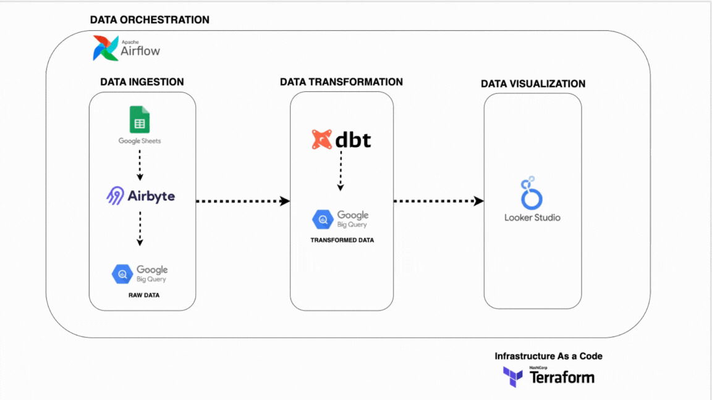
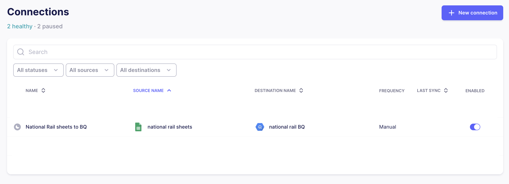

# National Rail UK Ticket Sales Data Pipeline

This project is a data pipeline built to handle and analyze mock train ticket sales data for National Rail in the UK. The pipeline processes data from January to April 2024, detailing various aspects such as ticket types, journey dates & times, departure & arrival stations, ticket prices, and more. This README provides an overview of the project, the tools used, and step-by-step instructions on reproducing the pipeline.

## Table of Contents

1. [Project Overview](#project-overview)
    * [Objectives](#objectives)
2. [Data Description](#data-description)
3. [Tools and Technologies](#tools-and-technologies)
4. [Architecture Diagram](#architecture-diagram)
    * [Data Flow](#data-flow)
5. [Setup Instructions](#setup-instructions)
    * [Prerequisites](#prerequisites)
    * [Setup Google Cloud Project](#setup-google-cloud-project)
    * [Setup The Data Source](#setup-the-data-source)
    * [Setup Airbyte Connectors, BigQuery Datasets, and GCS Bucket](#setup-airbyte-connectors-bigquery-datasets-and-gcs-bucket)


## Project Overview

The National Rail UK Ticket Sales Data Pipeline project is designed to simulate and manage the data processing workflow for train ticket sales across the United Kingdom. This project aims to provide a comprehensive data ingestion, transformation, orchestration, and visualization pipeline, leveraging modern data engineering tools.

### Objectives

- **Data Ingestion:** Automatically extract and load mock train ticket sales data into a data warehouse.
- **Data Transformation:** Clean, transform, and aggregate, raw data to create meaningful insights using dbt.
- **Data Orchestration:** Schedule and manage the end-to-end data pipeline using Airflow.
- **Data Visualization:** Create interactive dashboards to visualize key metrics and trends in ticket sales data using Looker.
- **Infrastructure as Code:** Use Terraform to provision and manage cloud infrastructure, ensuring reproducibility and scalability.


## Data Description 

The dataset used in this project simulates train ticket sales for National Rail in the UK from January to April 2024. The data is designed to resemble real-world ticket sales and includes various attributes crucial for analyzing travel patterns, pricing strategies, and station usage. 

You can download the data here : https://mavenanalytics.io/challenges/maven-rail-challenge/08941141-d23f-4cc9-93a3-4c25ed06e1c3

## Tools and Technologies

This project leverages powerful tools and technologies to build a robust and scalable data pipeline. Below is a brief overview of each tool used:

- **Airbyte:** An open-source data integration platform that extracts and loads data from data sources into BigQuery. Airbyte handles the data ingestion,

- **Terraform:** Terraform is An Infrastructure as Code (IaC) tool that automates the provisioning and management of cloud resources. It is used to set up and manage the infrastructure.

- **BigQuery:** A fully managed data warehouse provided by Google Cloud. BigQuery stores and analyzes the ingested data, offering scalability and fast query performance.

- **DBT (Data Build Tool):** DBT is a transformation tool that enables data modeling and transformation within BigQuery. It is used to clean, transform, and organize raw data into analytics-ready tables.

- **Airflow:** A workflow orchestration tool used to schedule and manage the various tasks within the pipeline. It ensures that each component of the pipeline runs in the correct sequence and on time.

- **Looker:** A business intelligence tool that connects to BigQuery to create interactive dashboards and reports. It visualizes the processed data, providing insights into ticket sales and other trends.

These tools work together to create an end-to-end data pipeline, from data ingestion to visualization.

## Architecture Diagram
The architecture of this data pipeline is designed to be modular and scalable, ensuring that each component can be managed and extended independently. Below is the architecture diagram :




### Data Flow

1. **Infrastructure As Code:** Terraform is used to automate the creation of the BigQuery dataset and configure the Airbyte connection, ensuring consistent and repeatable infrastructure setup.
2. **Data Ingestion:** Airbyte extracts data from the source (Google Sheets) and loads it into BigQuery.
3. **Data Transformation:** DBT transforms the raw data in BigQuery into structured, analytics-ready tables.
4. **Data Orchestration:** Airflow manages and schedules the pipeline's various tasks, ensuring they run in the correct order.
5. **Data Visualization:** Looker connects to the transformed data in BigQuery to create dashboards and reports.

## Setup Instructions
### Prerequisites

Before starting, ensure you have the following:

- **Python 3.10 or later:** If not installed, download and install it from the [official Python website](https://www.python.org/downloads/).
  
- **Docker and Docker Compose (Docker Desktop):** Install Docker following the [official documentation](https://docs.docker.com/get-docker/) for your operating system.

- **Airbyte OSS version:** Deploy the open-source version of Airbyte locally by following the [Airbyte installation instructions](https://docs.airbyte.com/deploying-airbyte/).

- **DBT Core:** Install DBT Core to manage and execute your data transformations. Follow the [DBT Core installation guide](https://docs.getdbt.com/guides/manual-install?step=1) to set it up.

- **Terraform (Optional):** Terraform can be used to provision and manage Airbyte and BigQuery resources. If you still need to install it, follow the [Terraform installation guide](https://docs.airbyte.com/using-airbyte/getting-started/oss-quickstart). This step is optional since the UI can create and manage Airbyte and BigQuery resources.

- **ASTRO CLI:** Astro CLI is required to manage Airflow in this projects. Follow the [Astro CLI installation guide](https://docs.astronomer.io/astro/install-cli) to get started.

- **Google Cloud account with BigQuery:** Ensure you have a Google Cloud account with BigQuery enabled. You'll need to grant the necessary permissions for Airbyte and dbt to access your BigQuery data, with detailed instructions provided in the steps below.


### Setup Google Cloud Project
1. **Create a Google Cloud Project**

    You can skip this step if you already have a Google Cloud project.

    1. Go to the [Google Cloud Console](https://console.cloud.google.com/).
    2. Click on the "Select a project" dropdown at the top left and select "New Project".
    3. Name your project and follow the steps to create it.

2. **Create a Service Account and Assign Roles**
    1. In the Google Cloud Console, navigate to **"IAM & Admin" > "Service accounts"**.
    2. Click **"Create Service Account"**.
    3. Name your service account.
    4. Assign the following roles to the service account:
        - **BigQuery Data Editor**: The service account can create, update, and delete data within BigQuery datasets.
        - **BigQuery Job User**: The service account can run BigQuery jobs, such as queries and data loads.
        - **Storage Admin**: The service account can create, delete, and manage buckets and objects in Google Cloud Storage (GCS).

4. **Generate a JSON Key for the Service Account**

    1. Generate a JSON key to allow the service account to authenticate and access Google Cloud resources.

        - After creating the service account, find it in the **“Service accounts”** list.
        - Click on the service account name.
        - Go to the **“Keys”** section.
        - Click **“Add Key”** and select **JSON**.
        - The key file will download automatically. **Copy** and **Paste** it to `dbt/national_rail` folder.
### Setup The Data Source
1. Download the dataset [here](https://mavenanalytics.io/challenges/maven-rail-challenge/08941141-d23f-4cc9-93a3-4c25ed06e1c3) and import the CSV into Google Sheets.

2. Go back to the [Google Cloud Console](https://console.cloud.google.com/).
    - Choose the Project you created earlier.
    - Navigate to **API & Services**.
    - Click **ENABLE APIS AND SERVICES**.
    - In the search box, search for **Google Sheets**.
    - Select **Google Sheets API**.
    - Click **Enable API**.
    - Click **Manage**.
    - In the left sidebar, choose **Credentials**.
    - Copy the email address in the **Service Accounts** section; it should match the service account you created earlier.

3. Share viewer access to the Google Sheets with the email address you just copied. This will allow Airbyte to access your sheets.


### Setup Airbyte Connectors, BigQuery Datasets, and GCS Bucket
To manage the Airbyte connection, BigQuery datasets, and GCS bucket efficiently, we're using Terraform. Here's how you can set this up:
   
1. **Go to Terraform directory**:
    ```bash 
    cd  terraform
    ```
2. **Change Configuration Files**:
    
    Inside the Terraform folder you'll find:
    - `providers.tf`: Defines the cloud provider and configuration for connecting Terraform to Google Cloud and Airbyte.
    - `main.tf`: Contains the main infrastructure definitions and resource configurations.
    - `variables.tf`: Declares input variables to customize your Terraform configurations.
    - `example_terraform.tvars`: Rename it into `terraform.tvars`; it stores variable values used to configure your infrastructure, replacing placeholders in variables.tf.

    Update the credentials in `terraform.tvars` with the details specific to your project:

    - `location`: Specifies the geographic region where resources will be deployed.
    - `dataset_id`: Name of the BigQuery dataset to be created.
    - `project_id`: The Google Cloud project name.
    - `credentials_json_path`: Path to the JSON key file for the Google Cloud service account.
    - `hmac_key_access_id`: Access ID for the HMAC key used in Google Cloud Storage.
    - `hmac_key_secret`: Secret associated with the HMAC key for Google Cloud Storage.
    - `gcs_bucket_name`: Name of the Google Cloud Storage bucket to be created.
    - `gcs_bucket_path`: Path within the GCS bucket for storing objects.
    - `workspace_id`: Identifier for the Airbyte workspace. For example your Airbyte url is  http://localhost:8000/workspaces/9243657b-f2f1-4bac-8ac7-b5f762861741/ then the `workspace_id` is `9243657b-f2f1-4bac-8ac7-b5f762861741`.
    - `spreadsheet_id`: Link of the Google Sheets spreadsheet to be used for data source.
    - `source_name`: Name of the Airbyte Source to be Created
    - `destination_name`: Name of the Airbyte Destination to be Created
    - `connection_name`: Name of the Airbyte Connection to be Created

3. **Run Terraform**:
    - Make sure you have [Airbyte](http://localhost:8000/) installed and running.
    - Initialize Terraform
        ```bash
        terraform init
        ```
    - Review the Terraform Plan
        ```bash
        terraform plan
        ```
    - Apply the Terraform Config, type **yes** when asked
        ```bash
        terraform apply
        ```
4. **Verify in Airbyte UI**:

   Go to the [Airbyte UI](http://localhost:8000/). Here, you should able to see the `connection`, `source`, and `destination` you just created.
   
    


### Setup DBT
DBT (Data Build Tool) allows you to transform data by creating, documenting, and running SQL workflows. To use DBT in this project, you must configure the connection details to BigQuery

1. **Go to DBT Project directory**:
    
    ```bash
    cd ../../dbt/national_rail
    ```
2. **Update profiles.yml**:

    Inside the folder, you'll find `example_profiles.yml`. First, rename it to p`rofiles.yml`. After that, update the following configurations based on your Google Cloud project:

    - `dataset`: The BigQuery dataset name you created with Terraform in the previous step.
    - `keyfile`: The path to your service account key.
    - `location`: Specifies the geographic region where the dataset will be deployed.
    - `project`: Your Google Cloud project ID.

3. **Test Connection**:
    
    ```bash
    dbt debug
    ```
    If the config is correct you'll see something like this :
    ```
    07:47:40  Connection test: [OK connection ok]
    07:47:40  All checks passed!
    ```
